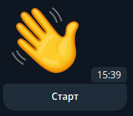
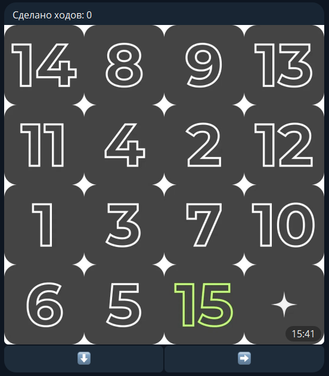
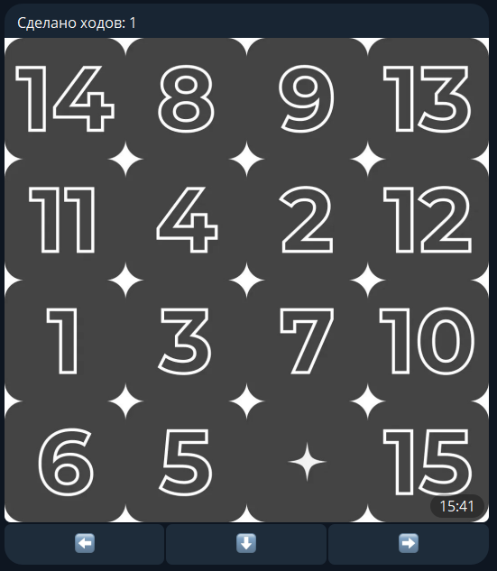
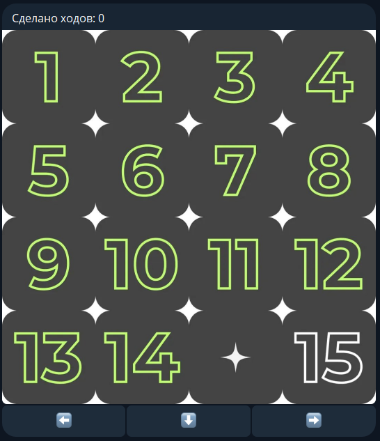
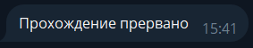

## Классические пятнашки 4x4 в Telegram

## Запуск

После ввода команды `/start` появляется приветсвенное меню:

## Стартовая позиция

Нажатие кнопки `Старт` формирует игровое поле со случайным расположением пятнашек 
и активирует счетчик сделанных ходов.

- Игровым полем является квадрат c пятнадцатью заполненными и одной пустой ячейками.
- Ячейки заполняются пятнашками - числами от 1 до 15.
- В стартовой позиции пустая ячейка всегда находится в правом нижнем углу.
- К игровому полю прилагается клавиатура с допустимыми перемещениями для текущей позиции.

## Пример хода

Ход выполняется с помощью кнопок-стрелок.
Каждая стрелка указывает направление, в котором пятнашка будет перемещена в пустую клетку.

Клавиатура является динамической.
Количество кнопок и их расположение будут различны в различных позициях.

)

## За ход до победы

Цель игры - расставить все пятнашки по возрастанию слева направо и сверху вниз.
Пятнашка, которая встает на свое место, становится зеленой.

Двигаем 15 влево и получаем следующее сообщение:

## Остановка игры

Игру можно прервать в любой момент командой `/stop`

